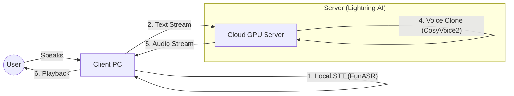

# 🎙️ Real-Time Voice Translator with Zero-Shot Cloning

A high-performance, bi-directional voice translation system designed for **hyper-low latency**. Unlike traditional cascading pipelines, this project utilizes a **hybrid streaming architecture** to provide simultaneous translation while preserving the speaker's voice identity (Zero-Shot Voice Cloning).

> **Course Project:** Software Engineering (Hyperautomation & Latency Optimization)

## ⚡ Key Features

* **Hybrid Architecture:** Offloads heavy AI inference (LLM + TTS) to a GPU cloud server while keeping lightweight STT on the client for privacy and speed.
* **Streaming Pipeline:** Implements a custom binary protocol to stream audio chunks immediately, reducing Time-to-First-Audio (TTFA) to <800ms.
* **Zero-Shot Voice Cloning:** Uses **CosyVoice 2** to instantly clone the user's timbre from a 3-second reference audio.
* **Smart Translation:** Powered by **Llama 3 (Groq)** for context-aware translations.
* **Performance Analytics:** Built-in instrumentation to measure End-to-End Latency, Network Wait times, and Processing bottlenecks.

## 🏗️ System Architecture

The system is split into two distinct components to maximize efficiency:



## 📂 Project Structure

```text
├── client/                  # Runs on your Laptop
│   ├── main.py              # Entry point
│   ├── gui.py               # CustomTkinter Interface
│   ├── audio_logic.py       # Audio handling & Networking
│   ├── analytics.py         # Latency benchmarking tool
│   └── client_environment.yml
│
├── server/                  # Runs on Cloud GPU (e.g., Lightning AI)
│   ├── server.py            # FastAPI Streaming Backend
│   ├── run.sh               # Startup script
│   └── server_environment.yml

```

## 🚀 Installation

### 1. Client Setup (Your Laptop)

*Requires: Microphone, Python 3.10*

1. Navigate to the client folder:
```bash
cd client

```


2. Create the Conda environment:
```bash
conda env create -f client_environment.yml
conda activate translator-client

```


3. Run the application:
```bash
python main.py

```


### 2. Server Setup (Cloud GPU)

*Requires: NVIDIA GPU (16GB+ VRAM recommended)*

1. Navigate to the server folder:
```bash
cd server

```


2. Create the environment and install dependencies:
```bash
conda env create -f server_environment.yml
conda activate translator-server

```


3. Start the server (this script handles model loading and tunneling):
```bash
chmod +x run.sh
./run.sh

```


4. **Copy the Public URL** generated by the script and paste it into the Client App settings.

## 📊 Analytics & Benchmarking

This project includes a custom analytics engine to demonstrate the efficiency of the streaming pipeline.

### Client-Side Reports

The client automatically logs every interaction to `benchmark_results.csv` with the following metrics:

* **Transcription Time:** Time taken by local FunASR.
* **Network Wait:** Time spent waiting for the first byte from the server.
* **Total Latency:** End-to-End time from "Silence Detected" to "First Audio Played".

### Server-Side Profiling

The server outputs real-time component breakdowns in the console:

```text
📊 [ANALYTICS] 'Hello, how are you?'
   ➤ LLM (Translate): 85ms
   ➤ TTS (Clone Voice): 320ms
   ➤ TOTAL SERVER TIME: 405ms

```

## 🛠️ Tech Stack

| Component | Technology | Role |
| --- | --- | --- |
| **GUI** | CustomTkinter | Modern, dark-mode user interface |
| **STT** | FunASR (SenseVoiceSmall) | High-speed local speech recognition |
| **LLM** | Llama 3 (via Groq) | Extremely fast translation inference |
| **TTS** | CosyVoice 2 (0.5B) | High-fidelity voice cloning |
| **Backend** | FastAPI | Asynchronous streaming server |
| **Audio** | PyAudio / SoundDevice | Low-latency audio I/O |

## 📜 License

This project is for educational purposes.

* **CosyVoice:** Apache 2.0 License
* **FunASR:** MIT License
